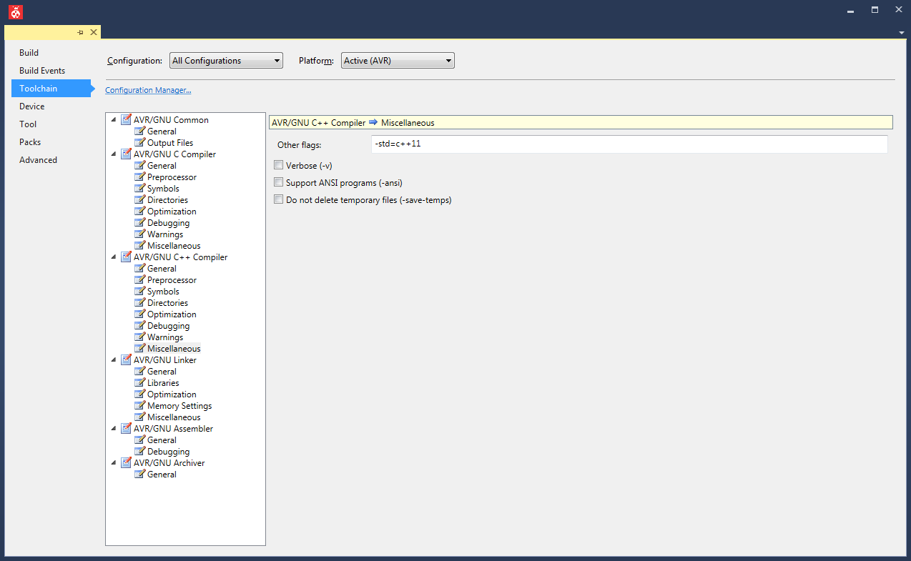

# LM75

Library for the LM75 Tmperature measurment chip


See [LM75](https://github.com/RedCali/LM75.git) for more detailed information on how to use LM75

## Open topics / Ideas

- [ ] Refactoring previous / first implementation
- [ ] Using Base class for I^2^C
- [ ] Documentation of Methods
- [ ] Arduino Keywords

## Include the Library in your project

To include the Library in your project you need to install it or take a copy in your project.

```cpp
// Include LM75 Library
#include <LM75.h>
```
Instantiate an object of the LCD

```cpp
LM75 TempSensor();
```

## Using with different IDE'S

### Arduino

The easiest way to get started on the Arduino Platform is, to use an example project like `LM75_simple`.

### PlatformIO

To include the Library in your PlatformIO project, you need simply to add it to your `platformio.ini`:

```yaml
lib_deps =
    https://github.com/RedCali/LM75.git
```

### Atmel Studio / Microchip Studio

For the use of this Library, `C++11` support needs to be enabled



